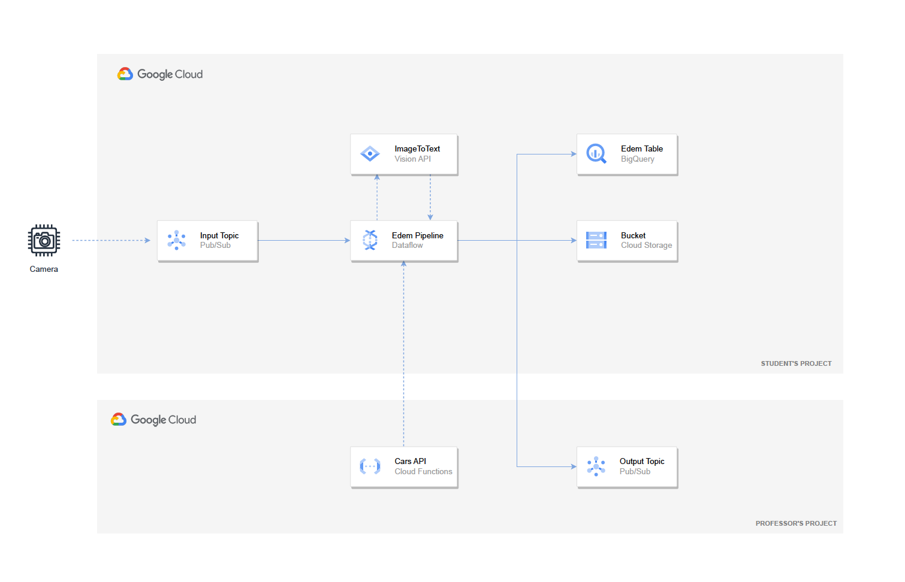
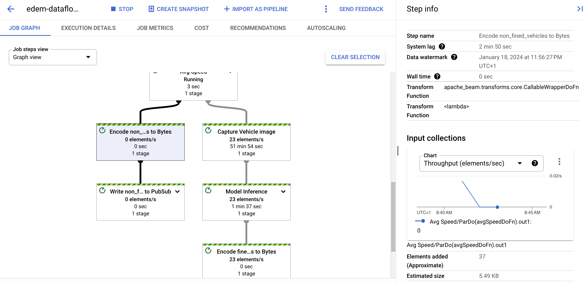
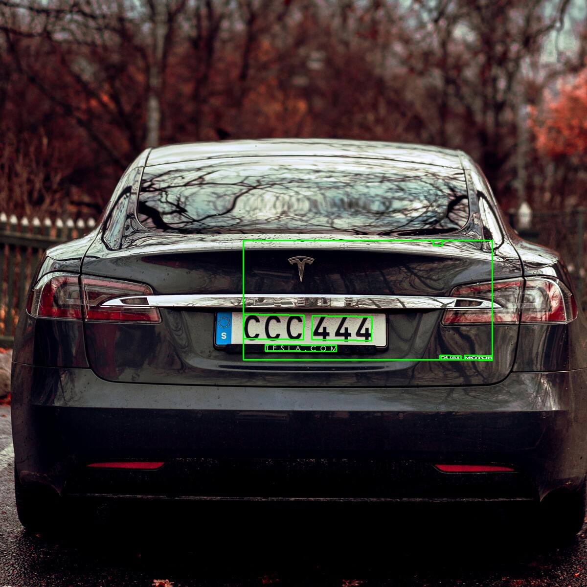

# Serverless Data Processing in GCP: Dataflow
EDEM 2024

- Professor: [Javi Briones](https://github.com/jabrio)

#### Case description


The New York City Hall, of which we are part of its Data team, has identified a significant increase in the number of traffic accidents in the Manhattan district due to vehicle speed. To address this issue, it has been decided to implement cameras equipped with Artificial Intelligence to monitor the speed of vehicles in specific sections. 

#### Business challenges

- Each camera will be set up in a particular section and must calculate the **average speed** of each vehicle.
- The average speed in the section should not exceed **25 miles** per hour (40 km/h).
- An **image** must be captured, the license plate number obtained, and the analyzed photo of all fined vehicles stored.

#### Case Requirements

- The data captured by different cameras should be sent to the **provided topic** during class for the proper visualization of the data.

- The data should also be stored in the **Data Warehouse** for subsequent analysis by the Analyst team. **[Homework Assignment]**.

- The notification message for fines should now include the **URL of the Google Cloud Storage Bucket where the image of the vehicle is stored**, to verify that the model has correctly captured the license plate text. **[Homework Assignment (optional)]**.


#### Data Architecture


## Setup Requirements

- [Google Cloud Platform - Free trial](https://console.cloud.google.com/freetrial)
- [Install Cloud SDK](https://cloud.google.com/sdk/docs/install)
- Clone this **repo**
- For this demo, we will be able to work both **locally** and in the **cloud shell**.
- Run this command to authenticate yourself with your GCP account (only locally).

```
    gcloud init
    gcloud auth login
    gcloud auth application-default login
```

- Enable required *Google Cloud APIs* by running the following commands:

```
gcloud services enable dataflow.googleapis.com
gcloud services enable pubsub.googleapis.com
gcloud services enable vision.googleapis.com
gcloud services enable cloudbuild.googleapis.com
```

- Create Python environment (Windows - Using CMD terminal)
```
python -m venv <ENVIRONTMENT_NAME>
<ENVIRONMENT_NAME>\Scripts\activate.bat
```

- Create Python Environment (Mac)
```
python -m venv <ENVIRONTMENT_NAME>
source <ENVIRONMENT_NAME>/bin/activate
```
- Install python dependencies by running the followinw command:

```
cd /02_Code
pip install -U -r requirements.txt
```

## PubSub

As a fist step, go to the [Google Pub/Sub console](https://console.cloud.google.com/cloudpubsub) and **create a topic**, making sure to check the option to create a default subscription. This topic will be responsible for collecting the data sent by the traffic camera for further processing.

## Google Cloud Storage

Now, go to the [Google Cloud Storage](https://console.cloud.google.com/storage) and create a bucket. This bucket must have a **globally unique name** and be **regional** and will serve as storage for temporary and staging files that Dataflow will need during its execution.

## Run Dataflow

```
cd /02_Code
```
- From **Local**
```
python EDEM_Dataflow_Streaming_Pipeline.py \
    --project_id <YOUR_PROJECT_ID> \
    --input_subscription <YOUR_INPUT_PUBSUB_SUBSCRIPTION_NAME> \
    --output_topic <YOUR_OUTPUT_PUBSUB_TOPIC_NAME> \
    --radar_id <YOUR_RADAR_ID> \
    --cars_api <API_URL>
```
- Run Pipeline in GCP: **Dataflow**
```
python EDEM_Dataflow_Streaming_Pipeline.py \
    --project_id <PROJECT_ID> \
    --input_subscription <YOUR_INPUT_PUBSUB_SUBSCRIPTION_NAME> \
    --output_topic <YOUR_OUTPUT_PUBSUB_TOPIC_NAME> \
    --radar_id <YOUR_RADAR_ID> \
    --cars_api <API_URL> \
    --runner DataflowRunner \
    --job_name <YOUR_DATAFLOW_JOB> \
    --region <YOUR_REGION_ID> \
    --temp_location gs://<YOUR_BUCKET_NAME>/tmp \
    --staging_location gs://<YOUR_BUCKET_NAME>/stg \
    --requirements_file <YOUR_REQUIREMENTS_FILE>
```

- Run **Generator**

The generator will simulate the transactions that can be performed on the company's ecommerce site.

```
cd /02_Code

python generator.py \
    --project_id <PROJECT_ID> \
    --topic_name <INPUT_PUBSUB_TOPIC_ID> \
    --initial_coordinates <COORDINATES_INITIAL_POINT> \
    --final_coordinates <COORDINATES_FINAL_POINT>
```



- Computer Vision Model Output




## Dataflow Flex Templates

- Go to the [Artifact Registry Console](https://console.cloud.google.com/artifacts) and create a repository with the default values. Alternativaly, it might be created using cli:

```
gcloud artifacts repositories create <YOUR_REPOSITORY_NAME> \
 --repository-format=docker \
 --location=<YOUR_REGION_ID>
```

- Build Dataflow Flex Template

```
gcloud dataflow flex-template build gs://<YOUR_BUCKET_NAME>/<YOUR_TEMPLATE_NAME>.json \
    --image-gcr-path "<YOUR_REGION_ID>-docker.pkg.dev/<YOUR_PROJECT_ID>/<YOUR_REPOSITORY_NAME>/<YOUR_IMAGE_NAME>:latest" \
    --sdk-language "PYTHON" \
    --flex-template-base-image "PYTHON3" \
    --py-path "." \
    --env "FLEX_TEMPLATE_PYTHON_PY_FILE=<YOUR_PATH_TO_THE_PY_FILE>" \
    --env "FLEX_TEMPLATE_PYTHON_REQUIREMENTS_FILE=YOUR_PATH_TO_THE_REQUIREMENTS_FILE"
```

- Run Dataflow Flex Template

```
gcloud dataflow flex-template run "<YOUR_DATAFLOW_JOB_NAME>" \
 --template-file-gcs-location="gs://<YOUR_BUCKET_NAME>/<YOUR_TEMPLATE_NAME>.json" \
 --parameters project_id="<YOUR_PROJECT_ID>",input_subscription="<YOUR_SUBSCRIPTION_NAME>",output_topic="<YOUR_OUTPUT_TOPIC_NAME>",radar_id=<YOUR_RADAR_ID>,cars_api=<API_URL> \
 --region=<YOUR_REGION_ID> \
 --max-workers=1
```

## Clean Up

- List your Dataflow pipelines 

```
gcloud dataflow jobs list --region=<YOUR_REGION_ID>
```

- Stop the dataflow job:

```
gcloud dataflow jobs cancel <YOUR_JOB_ID> --region=<YOUR_REGION_ID>
```

- Remove your PubSub Topics and Subscriptions

```
gcloud pubsub topics delete <YOUR_TOPIC_NAME>
gcloud pubsub subscriptions delete <YOUR_SUBSCRIPTION_NAME>
```

- Remove your Artifact Registry Repository

```
gcloud artifacts repositories delete <YOUR_REPOSITORY_NAME> --location=<YOUR_REGION_ID>
```

- Disable the required Google APIs

```
gcloud services disable dataflow.googleapis.com
gcloud services disable pubsub.googleapis.com
gcloud services disable vision.googleapis.com
gcloud services disable cloudbuild.googleapis.com

```

## Bibliography & Additional Resources

- [Apache Beam Basics](https://beam.apache.org/documentation/programming-guide/)

- [Apache Beam ML](https://beam.apache.org/documentation/ml/about-ml/)

- [Dataflow Flex Templates](https://cloud.google.com/dataflow/docs/guides/templates/using-flex-templates)

- [Dataflow Practical Exercises Guide](https://cloud.google.com/dataflow/docs/guides/)
